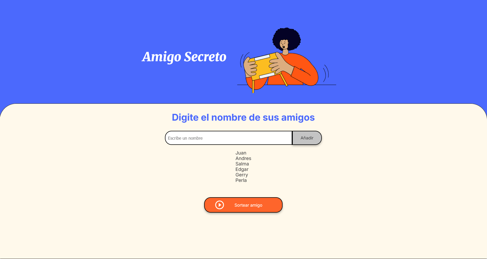

# Challenge Amigo Secreto

En este challenge se implementan funciones en JS para manipular arreglos y manipular el contenido del DOM; 
tambien se utilizan las funciones *floor* y *random* de la libreria *Math* para obtener un indice del arreglo y obtener el amigo secreto.

